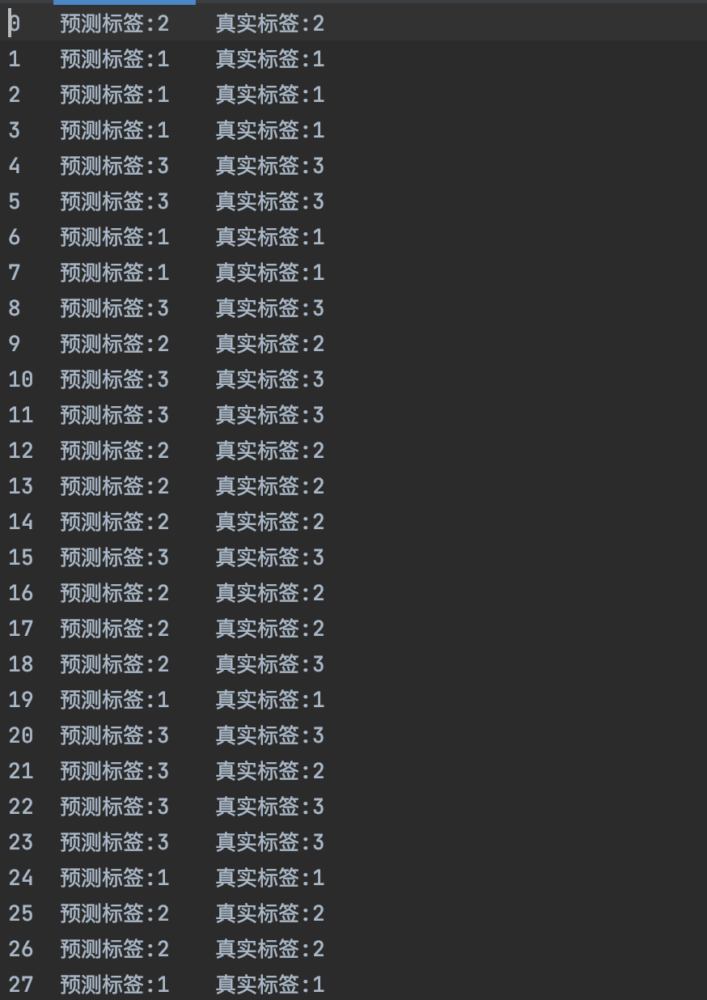
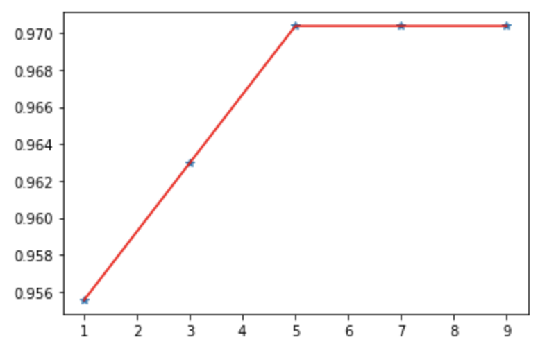

# FBDP_HW7
MapReduce的KNN算法分类鸢尾花数据集

姓名：盛祺晨				学号：191220093

[TOC]

## 题目描述

Iris数据集是常用的分类实验数据集，由Fisher, 1936收集整理。Iris也称鸢尾花卉数据集，是一类多重变量分析的数据集。数据集包含150个数据，分为3类，每类50个数据，每个数据包含4个属性。可通过花萼长度，花萼宽度，花瓣长度，花瓣宽度4个属性预测鸢尾花卉属于（Setosa，Versicolour，Virginica）三个种类中的哪一类。在MapReduce上任选一种分类算法（KNN，朴素贝叶斯或决策树）对该数据集进行分类预测，采用留出法对建模结果评估，70%数据作为训练集，30%数据作为测试集，评估标准采用精度accuracy。可以尝试对结果进行可视化的展示（可选）。

## 实现思路

输入格式: <k>  <label>  <test>  <train>  <output>
输入参数k，测试集的标签文件，测试集（不带标签），训练集，输出文件路径
利用python代码将原输入文件变成更有利于mapreduce处理的文件。

对标签的处理：setosa被认为是标签1；versicolor被认为是标签2；virginica被认为是标签3。

用留出法检验的train和test划分：利用sklearn.model_selection.train_test_split函数随机以0.7:0.3的比例划分训练和测试集。为了让结果更具可信性，减少随机性，划分了三次，设置了三组。

### Map

setup：读取test文件中的所有坐标，例如(5.5,2.4,3.7,1.0)，转换为double类型的四个数字。

map：读取当前文件的每一行，每一行默认是四个坐标+一个label，用逗号分开。于是读入一个train数据行后，计算这个已知点的的坐标和test文件（测试集）中所有点的欧氏距离。

最终写入context如下：

```java
context.write(new IntWritable(i), new Text(label+","+String.valueOf(dis)));
//i表示测试集中点的序号，label是当前读入的训练集的点的标签，dis表示测试集序号为i的点到当前读取的训练集的点的欧氏距离
```

### Reduce

setup：读取设定的k值，同样类似map一样读取label文件的所有标签（是真实标签，用来对比预测结果）。

reduce：对传入的距离进行排序，取最小的k个，对这k个对应的标签计数得到数量，求数量最大值所在的索引。相当于是在欧氏空间中，这最近的k个点对结果进行投票。

## 结果展示

某一文件中运行结果，参数：k=1



结果绘制和分析

K值和正确率的大致曲线。



绘制过程：用随机3:7切分的测试训练集进行准确率测试，对k=1,3,5,7,9进行测试，每个k值检测三次（不同切分的组）。发现得到的正确率如下

```python
[0.9555555555555556, 0.9555555555555556, 0.9555555555555556] # k=1
[0.9555555555555556, 0.9777777777777777, 0.9555555555555556] # k=3
[0.9777777777777777, 0.9777777777777777, 0.9555555555555556] # k=5
[0.9777777777777777, 0.9777777777777777, 0.9555555555555556] # k=7
[0.9777777777777777, 0.9777777777777777, 0.9555555555555556] # k=9
```

去平均，得到正确率为

```python
[0.9555555555555556,
 0.9629629629629629,
 0.9703703703703703,
 0.9703703703703703,
 0.9703703703703703]
```

即为上图的纵坐标。

## 缺陷

1.用了最简单的一种knn算法，没有根据距离远近进行加权。只是等权重地让最近的点“投票”。

